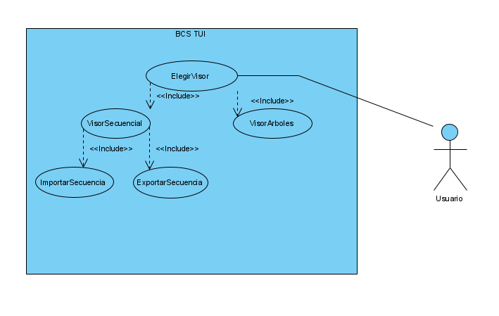

## Contenidos
1. [Información general](#información-general)
2. [Requisitos de usuario](#requisitos-de-usuario)
3. [Casos de uso](#casos-de-uso)
4. [Interfaz](#interfaz)
5. [Tecnologías](#tecnologías)
6. [Instalación](#instalación)
7. [Uso](#uso)


# BCS TUI
## Información general

Este proyecto se ha realizado con el fin de proveer al ITC (Instituto Tecnológico de Canarias) con una herramienta que permita manejar múltiples herramientas pasa visualizar
sequencias genéticas así como árboles filogenéticos.

Para profundizar más en la información referente a este proyecto y a cómo se ha realizado puede consultar el documento que se encuentra adjunto en:
https://github.com/Nxssie/BCS_TUI/blob/master/src/assets/docs/Proyecto%202%C2%AA%20Evaluaci%C3%B3n.pdf
<p></p>

***

## Requisitos de usuario

Para consultar los requisitos de usuario por favor refiérase a:
<p>https://github.com/Nxssie/BCS_TUI/blob/master/src/assets/docs/BCS-Requirements.pdf</p>

***

## Casos de uso

</img>
<p>Diagrama de casos de uso para el BCS TUI</p>

***

## Interfaz
### Diseño inicial


## Tecnologías

Frontend:
* [Angular](https://angular.io/): Version 11.1.1
***
Herramientas de visualización:
* [MSA Viewer](https://www.ncbi.nlm.nih.gov/projects/msaviewer/)
* [IGV](http://software.broadinstitute.org/software/igv/)
* [NCBI](https://www.ncbi.nlm.nih.gov/tools/sviewer/)
* [Auspice](https://docs.nextstrain.org/projects/auspice/en/latest/index.html)

## Instalación
Mediante la línea de comandos instale:

<li>npm
</li>
  
```bash
npm install npm@latest -g
```

<li>Angular CLI
</li>

```bash
npm install @angular/cli -g
```

***

Una vez terminado:

<li>Usando la línea de comandos ubíquese en donde quiera clonar el proyecto y ejecute:
</li>

```bash
git clone https://github.com/Nxssie/BCS_TUI
```

<li>Usando la línea de comandos ubíquese en la carpeta raíz del proyecto e instale los módulos necesarios con:
</li>

```bash
npm install
```

## Uso

Para poder usar esta aplicación:

<li>Para iniciar el servidor de Angular, ubíquese, mediante la consola de comandos, en la carpeta raíz del proyecto y ejecute:
</li>

```bash
ng serve
```

<li>Para iniciar el servidor de Auspice, ubíquese, mediante la consola de comandos, en la carpeta raíz del proyecto y ejecute:
</li>

```bash
auspice view --datasetDir src/assets/seq-data/set1/
```

Ya puede comenzar a utilizar esta aplicación accediendo a http://localhost:4200/ en su navegador.

Para utilizar las diferentes herramientas que ofrece la aplicación, seleccione el menú desplegable superior izquierdo y luego la herramienta que desee usar.

En caso de encontrarse con algún problema, por favor consulte el botón de "Help" que se encuentra en dicho menú desplegable.
